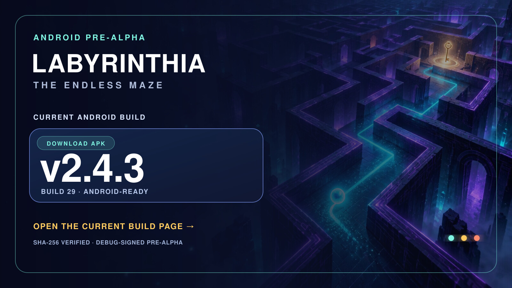

# Labyrinthia APK · v2.4.3

The front-page banner always points here so the APK call-to-action has one stable, version-aware destination.

## Current channel

**v2.4.3 · Android-ready · Pre-Alpha**

The repository contains the Android Studio project, the complete offline web game and a compiled debug APK for device testing.

## Current download

[Download Labyrinthia v2.4.3 debug APK](./downloads/Labyrinthia-v2.4.3-debug.apk)

- Package: `cloud.kosch.labyrinthia`
- Version: `2.4.3` (`versionCode 29`)
- Minimum Android version: Android 6.0 / API 23
- File size: `11,568,607` bytes (about 11.0 MiB)
- SHA-256: `fb4d594c22147d1a1e4b95d93aeff7c73987a1cbf33afe85cc7df80a9380597c`

## Weitere Repository-Seiten

- [Changelog](./CHANGELOG.md)
- [Versionsarchiv mit älteren APKs](./VERSIONS.md)

This APK is debug-signed for installation and UX testing. It is not the final Play Store-signed AAB. The banner and this page remain the stable entry point; future builds can replace the direct download without changing the front-page URL.

## Build the current APK locally

1. Open [`android/`](./android/) in Android Studio.
2. Install an Android SDK and let Android Studio sync the Gradle project.
3. Run `./gradlew assembleDebug` for a test APK or create a signed release build for distribution.
4. Keep signing keys and upload credentials outside this public repository.

For browser testing, serve the repository over HTTP(S) and open [`index.html`](./index.html). The core game is offline-first and stores progression locally.

[← Back to the visual front page](./README.md)
