

# ✦ Labyrinthia
## The Endless Maze

**Find the key. Read the maze. Escape the impossible.**

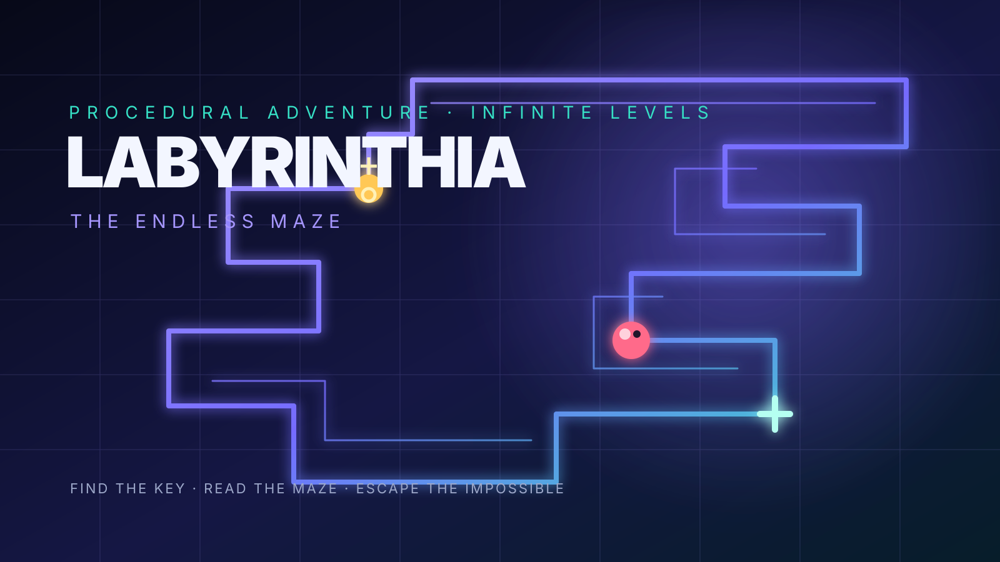

### An endless procedural maze adventure by KoSch

<a href="./APK-DOWNLOAD.md">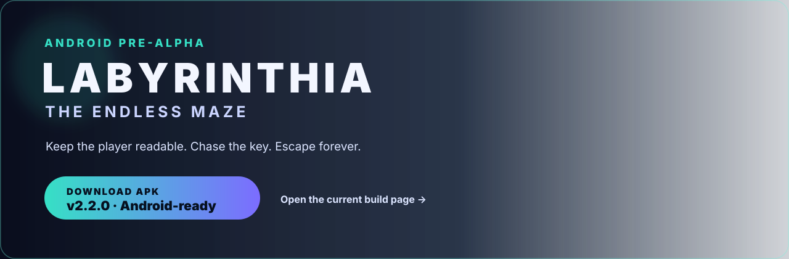</a>

The banner is versioned to <strong>v2.2.1</strong> and points to one stable APK build page.

> **Development status — important:** Labyrinthia is an experimental **Pre-Alpha**. It is playable and Android-ready, but it is not yet a finished Play Store release. Expect balancing changes, new visual polish and further device testing.

## Download and play

- **APK build page:** click the banner above or open [`APK-DOWNLOAD.md`](./APK-DOWNLOAD.md). It is the stable destination for the current APK version.
- **Direct APK:** download the current debug-signed Android build [`Labyrinthia-v2.2.1-debug.apk`](./downloads/Labyrinthia-v2.2.1-debug.apk) for device testing.
- **Download the source:** use GitHub's **Code → Download ZIP** or clone this repository. The repository stays source-first and the Android-ready project lives in [`android/`](./android/).
- **Browser preview:** serve the repository over HTTP(S), then open `index.html`.
- **Android Studio:** open the `android/` project and build the debug APK or a signed AAB.

> **APK status:** v2.2.1 is the current Android-ready Pre-Alpha build. The repository includes a debug-signed APK for testing; it is not the final Play Store-signed AAB.

## Why the game should stay fun for a long time

Labyrinthia is built around a simple loop that remains readable even as the challenge grows:

1. Enter a fresh, procedurally generated maze.
2. Keep the player large and legible while the camera follows through the maze.
3. Locate the key using spatial memory, the focused view and the complete minimap.
4. Reach the exit and choose whether to push into the next level.
5. Earn XP, rise through 1,000 ranks and unlock one of 1,000 persistent achievements.

The maze can extend far beyond the screen. Higher difficulty changes the scale of the world, not the readability of the player character.

## Visual product preview

The front page is designed like a small Play Store product page: one clear download action, a feature story and a six-screen sliderwheel. GitHub renders the linked strip below directly; the full swipeable version is available in [`docs/sliderwheel.html`](./docs/sliderwheel.html).

### What makes the loop feel good

<table>
  <tr>
    <td align="center"><a href="./assets/generated/camera-focus.jpg">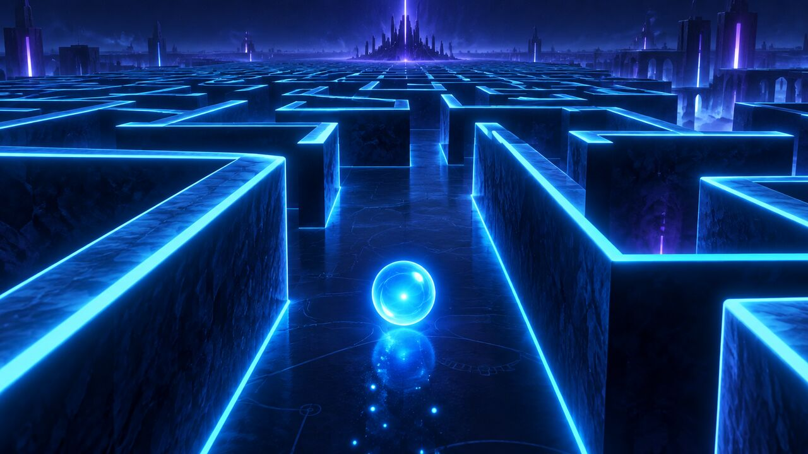</a> Readable camera focus</td>
    <td align="center"><a href="./assets/generated/tilt-controls.jpg">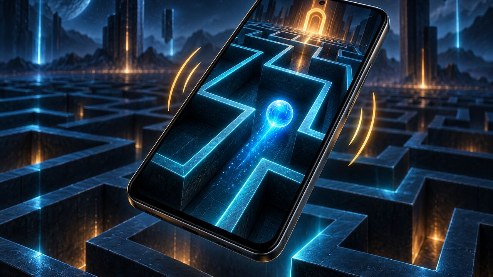</a> Motion controls</td>
    <td align="center"> Key-to-exit route</td>
  </tr>
  <tr>
    <td align="center"><a href="./assets/generated/tactical-minimap.jpg">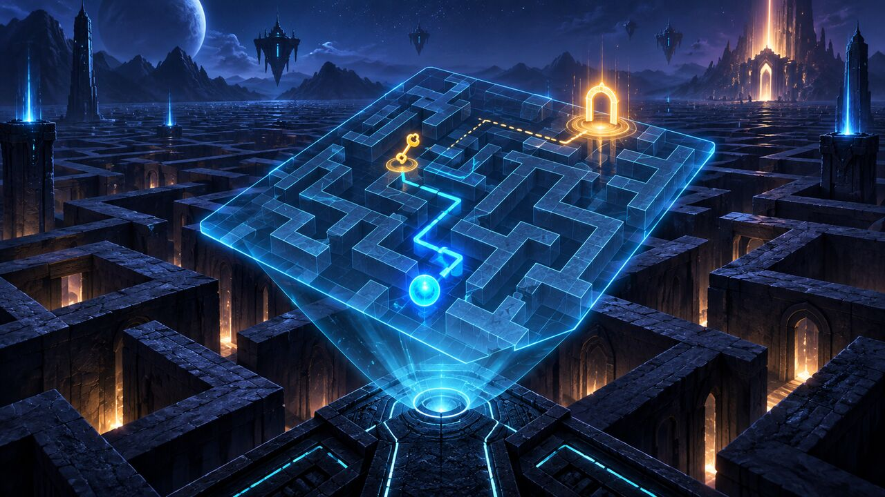</a> Plan with the minimap</td>
    <td align="center"><a href="./assets/generated/level-complete.jpg">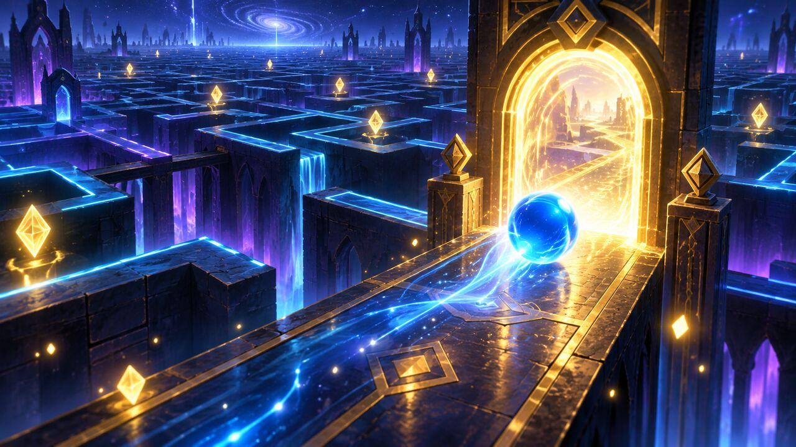</a> Reward the escape</td>
    <td align="center">Five generated 16:9 marketing motifs with exact copy kept in the UI assets below.</td>
  </tr>
</table>

<table>
  <tr>
    <td align="center"><a href="./assets/features/01-camera.svg">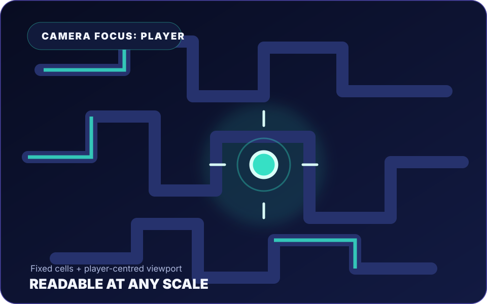</a></td>
    <td align="center"><a href="./assets/features/02-motion.svg">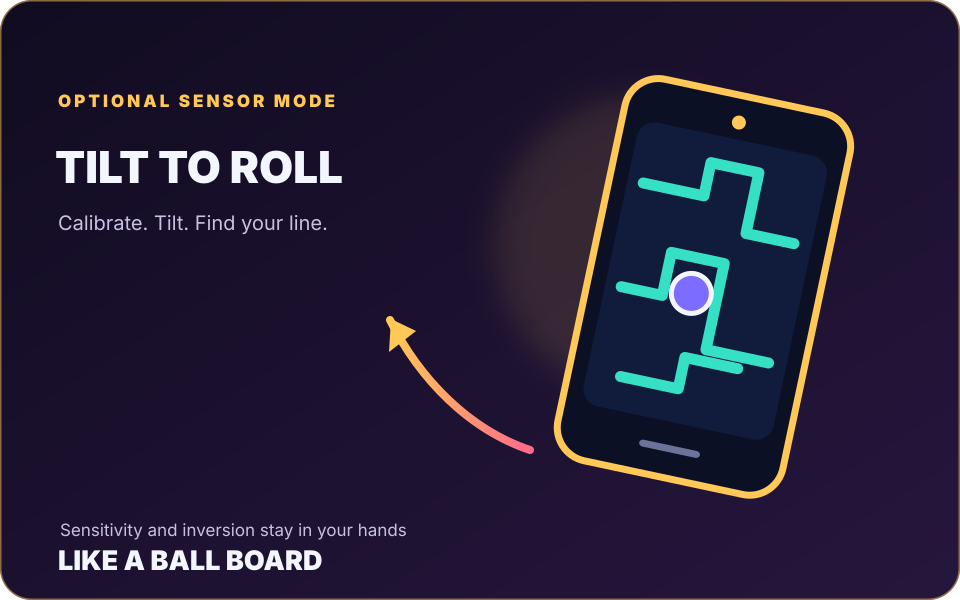</a></td>
    <td align="center"><a href="./assets/features/03-progression.svg">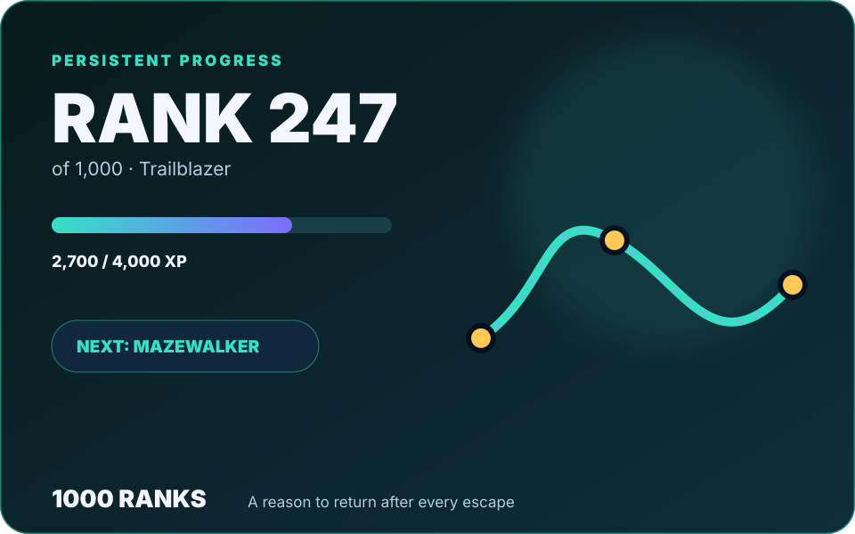</a></td>
  </tr>
  <tr>
    <td align="center"><a href="./assets/features/04-achievements.svg">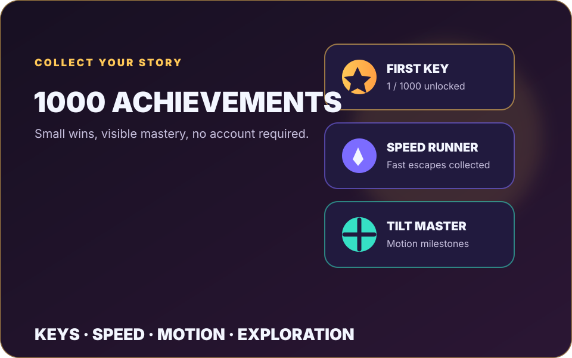</a></td>
    <td align="center"><a href="./assets/features/05-offline.svg">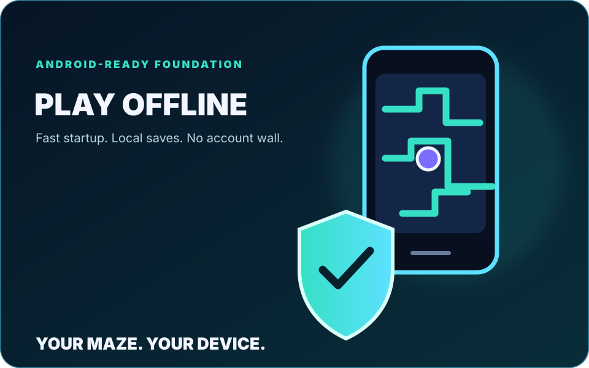</a></td>
    <td align="center"></td>
  </tr>
</table>

### Six in-game screens · ad-ready sliderwheel

<table>
  <tr>
    <td><a href="./assets/screens/01-main-menu.svg">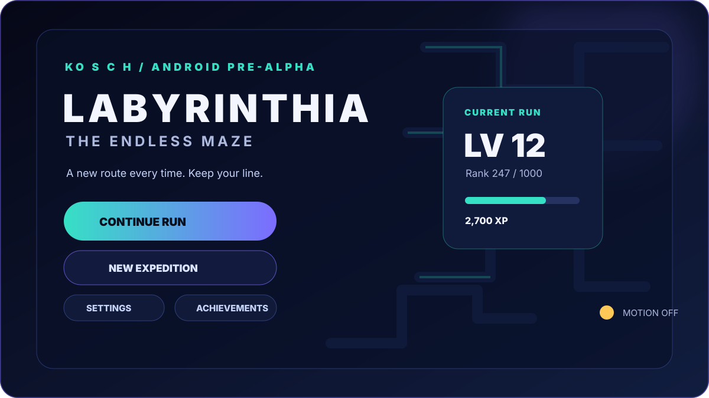</a></td>
    <td><a href="./assets/screens/02-camera-level.svg">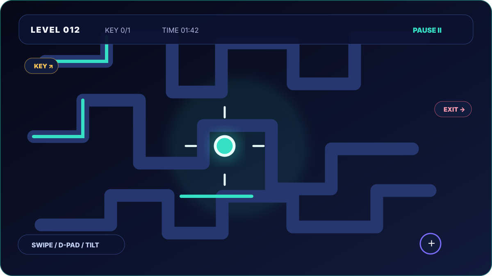</a></td>
    <td><a href="./assets/screens/03-minimap.svg">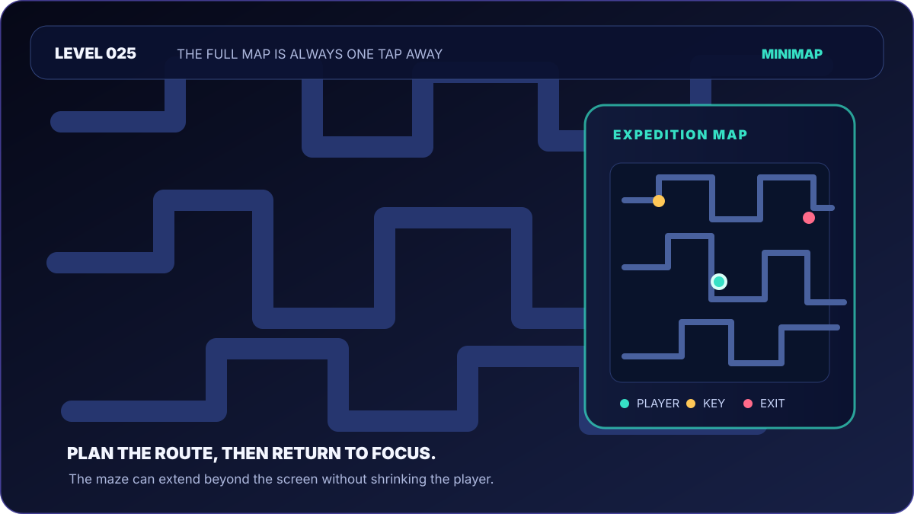</a></td>
  </tr>
  <tr>
    <td><a href="./assets/screens/04-motion-settings.svg">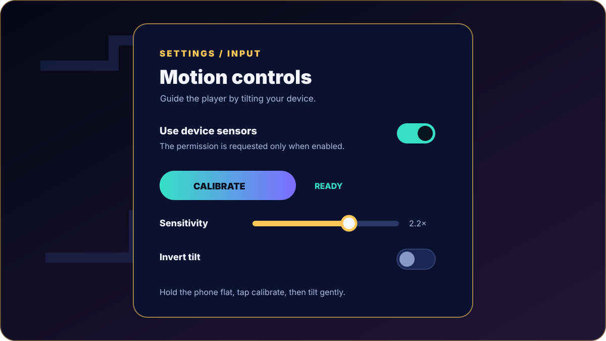</a></td>
    <td><a href="./assets/screens/05-achievements.svg">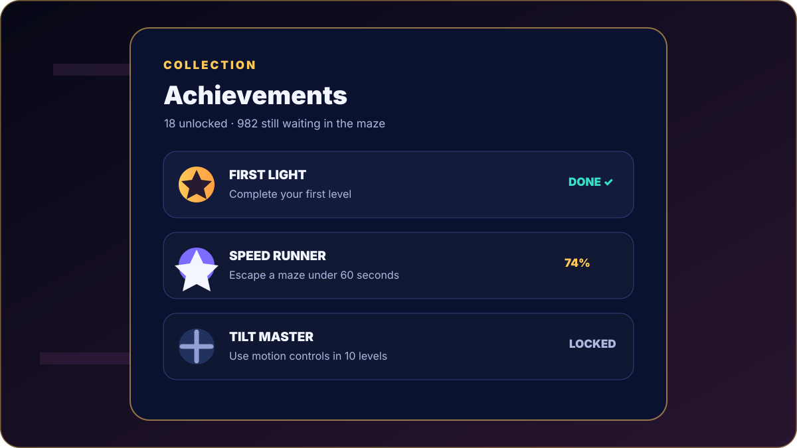</a></td>
    <td><a href="./assets/screens/06-completion.svg">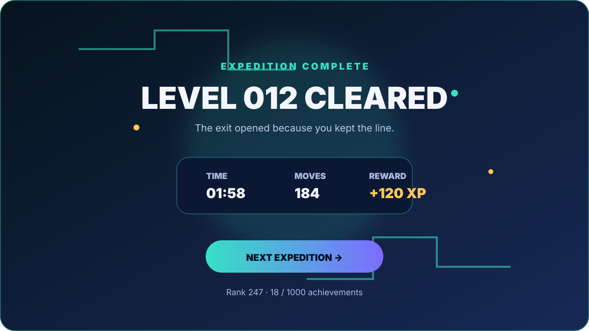</a></td>
  </tr>
</table>

<a href="./docs/sliderwheel.html"><strong>▶ Open the interactive six-screen sliderwheel</strong></a>

## Core experience

| Area | Current design | Why it matters |
| --- | --- | --- |
| Camera | Fixed-size cells with a player-centred viewport | Large mazes remain playable on small Android screens |
| Orientation | Full-maze minimap plus off-screen key/exit indicators | Players can plan without losing their sense of place |
| Input | Swipe, touch D-pad, keyboard and device motion | Comfortable on phone, tablet and desktop |
| Motion | Calibrate, sensitivity and inversion controls | Tilt movement feels like guiding a ball on a board |
| World | Endless level numbers with seeded procedural generation | No artificial final level |
| Progression | Local XP, 1,000 ranks and exactly 1,000 achievements | Long-term goals without an account or server |
| Offline | Relative modules, local storage and PWA caching | The core game can remain available without a network |

## Controls

| Platform | Controls |
| --- | --- |
| Touch | Swipe directly on the maze or use the D-pad |
| Keyboard | Arrow keys or `W A S D`; `Esc` pauses |
| Android sensors | Settings → enable motion controls → hold the device flat to calibrate → tilt |

The sensor mode can be switched off at any time. Haptic feedback is optional and can also be disabled in settings.

## Long-term motivation

Progress is stored locally on the device:

- **1,000 ranks:** XP-based titles from *Newcomer* to *Eternal Labyrinthian*.
- **1,000 achievements:** level gates, key collection, movement milestones, speed goals and motion-control mastery.
- **Endless levels:** level numbers are not capped; the generated maze grows up to a mobile-safe board size and then continues to become more demanding through route density and pace.
- **No forced community layer:** the game loop stays focused on the individual expedition, mastery and discovery.

## Visual and UX direction

The interface uses a focused sci-fi game language: high-contrast objectives, glowing path walls, large readable markers, a compact HUD and mobile-safe touch targets. Themes currently include Neon Night, Ember Temple, Verdant Run and Ice Circuit.

The design rules are deliberately strict:

- never make the player unreadably tiny;
- never hide the current objective;
- keep pause, settings and progress one tap away;
- reward mastery without interrupting the maze flow;
- keep the core game local and privacy-friendly.

## Mechanics and GUI upgrades included in v2.2.1

The newest playable build adds the requested physical and readability pass:

1. **Physikalische Sensorsteuerung:** Accelerometer-Werte werden auf Gravitation normiert; stärkere Neigung baut mehr Rollgeschwindigkeit auf.
2. **Kontinuierliches Wischen:** Eine gehaltene Richtung bewegt mehrere Zellen bis zum Loslassen, Wandkontakt oder Fallloch.
3. **Faire Fallen:** Ab Level 3 entstehen kleine, später größere/gebündelte Falllöcher. Start→Schlüssel→Ausgang bleibt als sichere Route garantiert.
4. **Savepoints:** Start und Schlüssel markieren Rücksetzpunkte; ein Fallloch setzt die Kugel dorthin zurück und erhält den Schlüsselstatus.
5. **Rollende Kugel:** Eased Bewegung, Kugel-Highlight und rotierende Naht machen jeden Schritt physisch lesbar.
6. **Gestuftes Leveldesign:** Die Schwierigkeit meldet Warm-up, Lochgrößen und Cluster direkt im HUD.
7. **Minimierbares HUD:** Karte, Steuerung, Aktionen und Zielchips lassen sich einzeln minimieren; der Header kann das Spielfeld maximieren.
8. **Lesbare Kartenansicht:** Die mobile Spielfeldhöhe ist begrenzt, damit die Umgebungskarte nicht mehr vom Labyrinth überdeckt wird.
9. **Lokales Audio-Feedback:** Falllöcher haben ein eigenes Warnsignal und Haptik.
10. **Vorbereitet für Ausbau:** Die sichere Routen-/Hazard-Schicht lässt sich später um verschiebbare Segmente, Schlüsselketten und Türen erweitern.

## Android build

The `android/` folder contains a native WebView wrapper. It:

- loads the local game through `WebViewAssetLoader`;
- enables fullscreen, hardware acceleration and safe-area friendly rendering;
- exposes the Android accelerometer to the web game through a small native bridge;
- keeps the web files at the repository root as the single source of truth.

Open `android/` in Android Studio with an Android SDK installed, or run `./gradlew assembleDebug` from `android/` for a reproducible test build. Keep signing keys and upload credentials outside this public repository.

## Development status

The current build is **v2.2.1 Android-ready / Pre-Alpha**. The next quality passes should focus on:

- device-by-device sensor tuning and accessibility testing;
- movable maze segments, multiple keys and intermediate savepoint doors;
- device performance profiling on very large levels;
- signed AAB preparation and Play Store listing assets.

See [`CHANGELOG.md`](./CHANGELOG.md) for the current release notes.

## Privacy

The core game does not require an account, location, contacts or background permissions. Progression is stored locally with browser/WebView storage. The Android wrapper only uses the accelerometer when the player explicitly enables motion controls.

**Labyrinthia is made to be explored, mastered and revisited.** ❣️

